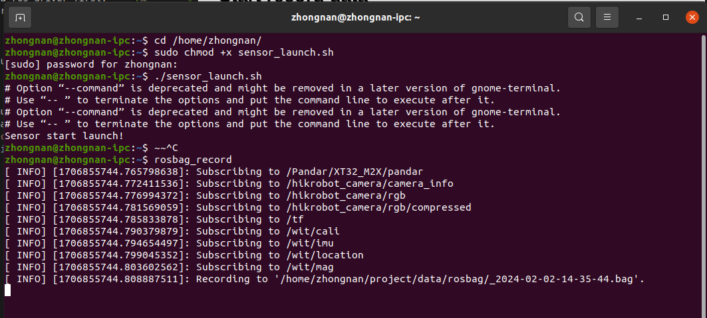

# SmartScanner
This repo contains sensor drivers of the smart scanner, including Hesai32M2X, IMU-HWT905-485, HIKROBOT camera

# How-To-Use
Before start to record data, please do some check:
1. Disk still remains space, at least > 100GB
2. Battery capacity > 20%
3. Hardware looks good
4. Calibration result is still work, which means the lidar, camera, imu still remains in their location

## Start launch sencor
- Open a terminal, run 
```bash
cd /home/zhongnan
sudo chmod +x sensor_launch.sh
./sensor_launch.sh
```
- This command will launch the lidar, imu, camera ros driver first, then after 5 seconds, it will launch the rviz for sensor data visualization. 


## Start record data
After successfully launch the sensor drivers, you can start to record the data for your reconstruction objects.
- Open another terminal, run
`rosbag_record`
- This command will record the lidar, camera, imu data through the ros1 topics and storage these data into the rosbag. The default rosbag storage location is under: `/home/zhongnan/project/data/rosbag`
- You can also use the following command to specify the topic you are interested:

```bash
rosbag record -b 2048 \
/Pandar/XT32_M2X/pandar \
/hikrobot_camera/rgb \
/hikrobot_camera/rgb/compressed \
/hikrobot_camera/camera_info \
/tf \
/wit/cali \
/wit/imu \
/wit/location \
/wit/mag \
-o /home/zhongnan/project/data/rosbag/
```


## Check data quality
After finishing record bag, data bag quality need to be checked before export data to SSD. Run the following command to check rosbag quality:
```bash
roscore
rqt_bag /path/to/your/bag 
```


## Export data via SSD
After check data quality, you can export the rosbag to other devive via remote disk. 

## Modify sensor parameters
For changing sensor parameters, esperially camera paramaters, you can go to `[path](deviceDrivers/src/hikrobot-mvs-camera-ros/config/camera-indoor.yaml)` to change related parameters. 

| 参数名 | 默认值 | 备注 |
|--|--|--|
| width | 4096 | 图像宽度|
| height | 3000 | 图像高度 |
| Offset_x | 0 | X方向偏置 |
| Offset_Y | 0 | Y方向偏置 |
| PixelFormat | 0 | 像素格式,enum类型<br>允许的取值为: <br>0: 0x01080009 BayerRG8|
| FrameRateEnable | true | 使能帧率控制 |
| FrameRate | 8 | 帧率 |
| ExposureTime | 5000 | 曝光时间(us)<br>经过实测，白天在户外光照充足的情况下，2ms可清晰成像<br>晚上在indoor需要提高到5ms<br>推测阴天需在2～5ms之间调节 |
| ExposureAuto | false | 允许自动曝光，由硬件内部自动实现 |
| AutoExposureTimeLowerLimit | 100 | 自动曝光下限 |
| AutoExposureTimeUpperLimit | 8000 | 自动曝光上限，此值基本上决定了帧率。要达到最大帧率8fps，曝光时间需在17ms以下 |
| BalanceWhiteAuto | 1 | 自动白平衡<br>0: Off<br>2: Once<br>1: Continuous |
| Brightness | 100 | 亮度，取值为0～255 |
| GainAuto | 2 | 亮度的固定增益<br>0: Off<br>1: Once<br>2: Continuous |
| CalibrateEnable | false | 开启图像畸变校正。非硬件实现，由opencv实现，速度较慢 |
| TriggerMode | 0 | 触发模式，关闭时会自动推送图像流，开启时需实现软触发或硬触发<br>0: Off<br>1: On |
| ResizeEnable | false | Resize image |
| DestinationHeight | 640 |  |
| DestinationWidth | 640 | |

